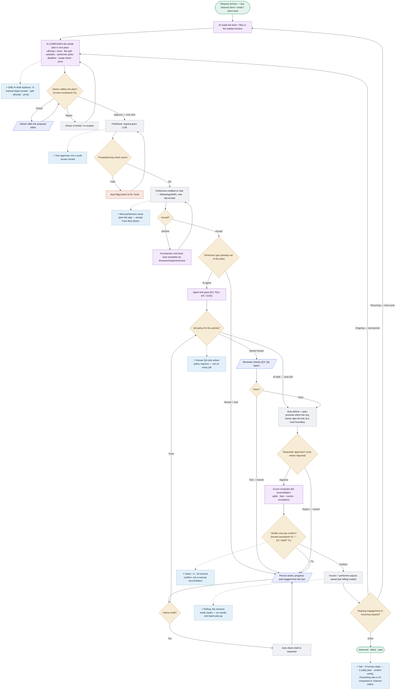

# WS 3.0 — Onboarding & Delivery

> The two efficiency-first flows are embedded below (they render on GitHub). Sources: `onboarding-flow.mmd`, `delivery-flow.mmd`. Detailed write-ups follow the diagrams.

## Flow 1 — Onboarding (efficiency-first)

```mermaid
%% WS 3.0 — ORGANIZATION ONBOARDING (efficiency-first).
%% Efficiency shift: NOT "fill 7 blank forms" — instead SEED a workspace from an
%% industry archetype, then RATIFY + fill only the gaps the readiness engine flags (JIT).
%% Dotted purple = AI does it · dotted teal (⚡) = why it's the efficient way.
flowchart TD
  classDef form fill:#E8ECFB,stroke:#3B5BDB,color:#12162a;
  classDef sys fill:#EFF1F5,stroke:#9aa1ad,color:#191C22;
  classDef dec fill:#F7ECD6,stroke:#B7791F,color:#3a2c0a;
  classDef state fill:#E4F3EC,stroke:#2F9E6B,color:#123a25;
  classDef ai fill:#F3E9FB,stroke:#8A4FBF,color:#2e1740;
  classDef eff fill:#E3F0FA,stroke:#1F7A9E,color:#0c2e3a,stroke-dasharray:4 3;

  %% ---- A. PROVISION (operator — minimal) ----
  subgraph A["A · PROVISION  (platform operator)"]
    S(["Start: New Organization"]):::state --> A1[/"MINIMAL FORM: org name + deployment tier + admin email"/]:::form
    A1 --> A2["System creates workspace + emails admin an invite"]:::sys
    A2 --> A3["Admin logs in → Setup home"]:::sys
  end
  A1 -.-> EA["⚡ 3 fields create a tenant — nothing asked until a feature needs it"]:::eff

  %% ---- B. SEED FROM ARCHETYPE (the big efficiency move) ----
  subgraph B["B · SEED THE WORKSPACE  (pick a starting point, don't build blank)"]
    A3 --> B1{"Pick industry archetype<br/>translation · creative · research · tech · generic"}:::dec
    B1 --> B2["AI builds a STARTER workspace from the archetype:<br/>catalog + capabilities · common skills · default roles ·<br/>SLA bands · pricing bands · notification defaults"]:::ai
  end
  B2 -.-> EB["⚡ ARCHETYPE SKELETON — you begin from a working draft, not empty forms"]:::eff

  %% ---- C. RATIFY + JIT GAP-FILL (readiness engine drives it) ----
  subgraph C["C · RATIFY & FILL ONLY THE GAPS  (readiness-engine driven)"]
    B2 --> C0["Readiness dashboard: 'You can deliver once these are set' (live)"]:::sys
    C0 --> C1[/"RATIFY operating entities — confirm/add (currency, tax, prefix)<br/>one org → many entities"/]:::form
    C1 --> C2[/"RATIFY teams & roles — AI mapped them; rename/tweak<br/>(EZ: SWAT / QA / SME / pool)"/]:::form
    C2 --> C3[/"RATIFY catalog — pre-filled offerings + levels + delivery/billing model;<br/>edit prices, add/remove"/]:::form
    C3 --> C4[/"RATIFY skills + pricing units — pre-filled; adjust rates<br/>(EZ: coins/credits)"/]:::form
  end
  C0 -.-> EC1["⚡ JIT — asks ONLY what's missing to deliver, in priority order"]:::eff
  C4 -.-> EC2["⚡ You EDIT AI proposals; you never author from a blank page"]:::eff

  %% ---- D. PEOPLE (self-onboard) ----
  subgraph D["D · ADD PEOPLE  (they self-onboard)"]
    C4 --> D1["Bulk-invite / connect directory (SSO-ready)"]:::sys
    D1 --> D2["Per person: AI pre-fills profile from their portable identity/history"]:::ai
    D2 --> D3[/"Person ratifies profile + declares skills"/]:::form
    D3 --> D4{"Auto-approve by policy?"}:::dec
    D4 -->|"Yes"| D5["Person active"]:::sys
    D4 -->|"Needs review"| D6[/"Admin approves"/]:::form
    D6 --> D5
  end
  D5 -.-> ED["⚡ People onboard themselves; admin handles only exceptions"]:::eff

  %% ---- E. GO LIVE, THEN DEEPEN JIT ----
  D5 --> E1{"Any prepaid billing?"}:::dec
  E1 -->|"Yes"| E2[/"Fund wallet"/]:::form
  E1 -->|"No"| E3
  E2 --> E3{"Readiness: minimum-viable config complete?"}:::dec
  E3 -->|"No — 1-2 gaps shown"| C0
  E3 -->|"Yes"| READY(["✅ WORKSPACE OPERATIONAL — it can deliver"]):::state
  READY --> F1["Everything else stays JIT: more offerings, SLAs, integrations,<br/>modules (payroll/HR/invoicing) — activated only when a job needs them"]:::sys
  F1 -.-> EF["⚡ No big-bang setup — the workspace deepens as it's used"]:::eff

  %% ---- Tenant-Zero note ----
  READY -.-> TZ["EZ onboards through THIS SAME flow (no back-door) —<br/>its SWAT/catalog/coins are just this workspace's config"]:::eff
```



## Flow 2 — Delivery (efficiency-first)



---


# WS 3.0 — Full Journey: Organization Onboarding → Assignment Delivery

**Status:** Draft v1 — design/workflow only, no code. For Shreyanshi/Joy/Bhavya review.
**Sources:** Foundational Vision (§2.2, §2.5, §3–4, §9, §13), Joy's `01-core-delivery.md`, the Workflow Mapping Brief, the dissolve-ERP decision.
**Legend:** `⚠️` = design decision I'm making (confirm/correct) · `❓` = open question routed to Joy/Bhavya.

---

## 0. Framing & locked decisions

- **1 organization = 1 workspace = 1 tenant**, holding **many operating-entities** (EZ = one WS with EZ Lab / ArabEasy / CASPR).
- **Three levels:** L0 Platform Operator → L1 Workspace Admin → L2 Operational roles.
- **"Onboarded" = the organization can take a request all the way to delivery + invoice.** Onboarding therefore *includes* the minimum-viable configuration (Part C).
- **Build fresh** to the WS 3.0 target (not WS 2.0 behavior); adopt Joy's mapped rules.
- **No back-door:** EZ (Tenant-Zero) is onboarded through this exact journey — it configures itself through the same surface every future org uses.
- **North-star config principle:** *every dimension is a first-class, declarative config object with smart defaults and an archetype skeleton, exposed through a guided admin surface — never a blank scripting canvas.* The WS admin controls **everything**, by tuning structured options, not by writing logic.

---

## Part A — The structural model (L0 / L1 / L2)

```
┌───────────────────────────────────────────────────────────────┐
│ L0  PLATFORM OPERATOR (the WS team)                            │
│  • provisions workspaces  • assigns each WS its admin          │
│  • sets deployment tier + which modules are available          │
│  • oversight — NOT the tenant's operating model                │
└───────────────┬───────────────────────────────────────────────┘
                │ provisions
        ┌───────▼───────────────────────────────────────────────┐
        │ L1  WORKSPACE  (= organization = tenant)               │
        │   Governed by the WORKSPACE ADMIN — the operating-     │
        │   model editor. Configures EVERYTHING (declaratively): │
        │   entities · catalog · skills · teams/roles · pricing  │
        │   · billing models · wallet · SLAs · allocation policy │
        │   · module activation · notifications · terminology    │
        │   (delegated module-admins sit under the admin, §9.2)  │
        └───────┬───────────────────────────────────────────────┘
                │ operates within
        ┌───────▼───────────────────────────────────────────────┐
        │ L2  OPERATIONAL ROLES (need-to-know scoped)            │
        │   SWAT/ops · Owner · Expert · QA · Requester/cc ·      │
        │   AI-agent — the delivery actors. Role *types* are     │
        │   platform primitives; the *named teams* are L1 config.│
        └───────────────────────────────────────────────────────┘
```

**Key layering (so nothing EZ-specific is hardcoded):**
- **Platform primitives** (fixed): the workspace boundary, the role *types* (request / assignment / activity access), the lifecycle state-machine shape, the config *object types*.
- **Tenant config** (L1 admin, per workspace): the *values* — EZ's SWAT/QA/SME/pool team names, its 15 capabilities / 79 offerings, its coin economy, its SLAs. All data, never code.

`⚠️` L0 scope is deliberately minimal for now (provision + module-availability + oversight); its full spec is parked until we know more.

---

## Part B — Organization Onboarding Journey (L0 → L1)

**Goal:** stand up a live-but-empty workspace with an admin, ready to be configured. Manual for now, designed to become AI-assisted.

| # | Actor | Action | Result |
|---|---|---|---|
| B1 | L0 Platform Operator | Create workspace for the organization | Workspace record exists (tenant boundary established) |
| B2 | L0 | Set **deployment tier** (Shared / Regional / Sovereign) + keys | Storage/processing posture set (Phase-1 EZ = Shared) |
| B3 | L0 | Set **module availability** (which first-party modules this WS may activate) | The WS admin's config palette is bounded |
| B4 | L0 | Assign the **Workspace Admin** (invite the first admin user) | L1 admin identity created; ownership handed off |
| B5 | L0 → L1 | **Handoff** | Workspace is *provisioned* — not yet *operational* |

**State at end of B:** an empty workspace with an admin and a bounded config palette. It **cannot deliver yet** — that's Part C.

`⚠️` People onboarding is **not** here — users/experts are added by the L1 admin *inside* the workspace (Part C). Portable identity + SSO federation (§2.2) is deferred to Phase 2; Phase 1 = admin creates/invites users directly.

---

## Part C — The Configuration Journey (L1 admin → "able to deliver")

**This is the crux of "onboarded = can deliver."** Below is the **minimum-viable config dependency chain**, derived directly from the *pre-conditions and steps* in Joy's `01-core-delivery.md`. It answers: *what must the WS admin configure before the very first assignment can flow to delivery + invoice?*

### C.1 The dependency chain (what unblocks what)

```
(1) FOUNDATION
    Organization identity + ≥1 Operating-Entity (legal/billing: currency, tax, invoice prefix)
        │  required by → invoicing, wallet, entity invoice codes
        ▼
(2) PEOPLE & ROLES
    ≥1 user per operational role: an Owner/SWAT, ≥1 Expert, a Requester
    + role permissions (e.g. requester.can_request_create)   [pre-cond: CreateRequest permission]
        │  required by → request creation, allocation (someone to assign)
        ▼
(3) TEAMS (the delivery engine, as config)
    SWAT / QA / SME / pool defined as configured teams; sign-off points
        │  required by → allocation routing, Verify sign-off
        ▼
(4) CATALOG
    ≥1 Offering the requester can request (offering ~ level ~ src ~ tgt ~ unit ~ capability)
        │  required by → assignment creation (pick offering)
        ▼
(5) SKILLS
    the skills the offering needs  +  the MANDATORY "Delivery" skill   [pre-cond: Delivery skill row]
    + rate list (coins/unit) for expert cost
        │  required by → activity creation (TR/PR/QA + Delivery), allocation match, payout
        ▼
(6) PRICING / INVOICE CODES
    an Entity with an invoice-pricing record whose invoice_code matches the assignment
    + payment type (prepaid / postpaid)                       [pre-cond: invoice_code_list match]
        │  required by → assignment creation, invoicing at delivery
        ▼
(7) WALLET  (only if payment type = prepaid)
    a funded wallet for the entity/requester                  [pre-cond: creditAssignment succeeds]
        │  required by → assignment creation (prepaid debits wallet)
        ▼
   ✅ MINIMUM-VIABLE WORKSPACE — the first assignment can now flow end-to-end.
```

### C.2 Mapped to the §9 config layers + the WS-admin surface

| Config layer (§9) | What the WS admin sets | Chain items |
|---|---|---|
| **Foundation** | Org identity, operating-entities, deployment tier, keys | (1) |
| **Operating Model** | Catalog (offerings/levels), skills + rate lists, teams/roles (the delivery engine), SLAs, allocation weights, billing models, terminology, transparency defaults | (3)(4)(5) |
| **Relationships** | Per-entity/-client pricing (invoice codes), per-client SLAs, QA reference data | (6) |
| **Live Operations** | People/experts + skill assignment, rate updates, module activation, wallet funding, integrations | (2)(5)(7) |

### C.3 Design notes
- **The "Delivery" skill is a platform primitive rendered as config** — every assignment auto-creates a mandatory Delivery activity (`sort_order=999`). The admin doesn't invent it; it's seeded, and the admin assigns performers to it.
- **Billing models are config, not code** — unit×price is the default, but *project / retainer / BOT* must be selectable per offering (per the catalogue; AI Transformation is BOT). `❓ Joy:` which billing models must the first EZ cut support?
- **"Smart onboarding" (later):** an **archetype skeleton** pre-seeds a plausible catalog/teams/skills for the org's industry, then **JIT enrichment** (never ask for a field until a feature needs it) + **AI-assisted** ratification. For now the admin fills it manually through the guided surface.

---

## Part D — The Delivery Journey (L2 — WS 3.0 target)

**Adopt Joy's `01-core-delivery` as the spine**, rendered as the WS 3.0 *target* (the fixes applied). The vision's 9 stages:

**Request → Create Assignment → Propose → Approve → Publish → Allocate & Start → Deliver → Mark Completed → Verify**

| Stage | What happens | Config it consumes (from Part C) | WS 3.0 fix vs today |
|---|---|---|---|
| **Request** | Requester submits a brief (manual / Phrase / email intake) | (2) permissions | Ambient AI maps brief → offering inline (§2.4) |
| **Create Assignment** | SWAT/owner picks offering; mandatory Delivery activity minted; payment type resolved | (4) catalog, (6) invoice code, (7) wallet | Robust validated creation → kills malformed-request scripts |
| **File split** | file → parts → activities (TR/PR/QA); unit-count split (remainder→first part) | (5) skills, unit types | AI scope-sheet (counts/complexity/deadline) before commit |
| **Propose / Allocate** | Propose performer(s); expert accepts/rejects | (2)(3)(5) experts+teams+skills, allocation policy | Intelligent channel-native mobilization (one-tap accept) → SWAT stops chasing |
| **Publish / Start** | On first expert accept, assignment/request go live | — | Push, not poll |
| **Work** | Expert works (TR42 or direct); interim/progress updates | (5), TR42 integration | Clean Editor sync → TR/PR workaround edge-cases vanish |
| **Deliver** | Activity/assignment delivers when all children terminal; auto-deliver cascade; owner boundary sign-off | (3) sign-off | **Mandatory boundary review = explicit Approve gate** (resolves ⚠D2) |
| **Mark Completed** | Commercial trigger | (6) pricing | **Decoupled from invoicing** — see Verify |
| **Verify (V&S)** | SWAT TL signs off; *then* invoice + payout, run rolling | (6)(5) rates/coins, invoicing module | **Explicit, server-authoritative Verify gate before the commercial trigger (resolves ⚠D4)** — no auto-invoice-on-complete, no repair crons |

**The single most important WS 3.0 change (from Joy's ⚠D4):** today the code auto-invoices *synchronously* on mark-complete, and a repair cron (`check_marked_complete_request_vs`) later fixes requests that skipped V&S. **WS 3.0 makes Verify an explicit human gate** — nothing flows to invoicing/payout until the TL signs off — so the drift, and the repair cron, cease to exist.

**Status/state, unified:** one lifecycle engine computes state-change **and** status in the same transaction/replayable event — no async drift, no `fix_*_conflicts` crons (the seam Joy identified).

---

## Part E — The stitched end-to-end journey (one narrative)

*Example: onboarding "Acme Localization" — the same path EZ walks as Tenant-Zero.*

1. **L0** creates Acme's workspace, sets tier = Shared, activates the Delivery + Invoicing + Wallet + People modules, invites Acme's admin. *(Part B)*
2. **Acme's WS admin** configures the minimum-viable set — one operating-entity, a Translation offering with its levels, the required skills + Delivery skill + rate list, a SWAT team + one expert + a requester, an invoice-pricing record (postpaid), done. *(Part C)* → **workspace is now "onboarded."**
3. A **requester** submits "translate this 20-page deck, EN→AR." **Ambient AI** proposes *Translation · EZ Assured · EN→AR* inline; requester approves. *(Request)*
4. **SWAT** creates the assignment, the file splits into parts → TR/PR/QA activities, AI emits a scope sheet. *(Create Assignment / split)*
5. SWAT proposes an expert; the expert gets a **one-tap WhatsApp accept**. *(Allocate / mobilize)*
6. Expert works in TR42 → interim updates → delivers. Auto-deliver cascades; owner signs off at the boundary. *(Work / Deliver)*
7. **SWAT TL verifies (V&S)** → *only now* the invoice + expert payout are generated, rolling. *(Verify → commercial trigger)*
8. Result: deliverable in the client's store, invoice raised, expert paid — **no drift, no repair cron, no spreadsheet.**

**The dependency truth:** step 3 is impossible without step 2's config, and step 2 is impossible without step 1's provisioning. That chain *is* "onboarded = can deliver."

---

## Part F — Open items & architecture implications

**For Joy** (from `01-core-delivery`, they gate the delivery detail):
- ❓A1 Allocation mutation (how the pending expert access row is created) · ❓A2 Mobilization path · ❓A3 Progress authority · ❓A4 "Feedback pending" gate · ❓A5 Who triggers delivery · ❓A6/⚠D4 Verify as the human gate.
- ❓ Which **billing models** the first EZ cut must support (unit / project / retainer / BOT).
- ❓ The **delivery engine** definition (SWAT/QA/SME/pool) — still needed to finalize Part C(3).

**For Bhavya** (architecture v2):
- The **tenant-isolation boundary** — how L1 workspaces are isolated (DB-shard / RLS / schema-per-tenant) now that all modules (incl. payroll/invoicing) are multi-tenant.
- **Transactional vs event-sourced** lifecycle engine (the Part D unification).
- GraphQL gateway exposure + persisted-queries.

**Typed domain model (feeds Shreyanshi):** Workspace → Operating-Entity → {Users/Roles, Catalog(Offering/Level), Skills/RateList, Teams, Pricing/InvoiceCode, Wallet} → Work graph (Request → Assignment → Activity + role/role_type/role_status). Replace the WS 2.0 `data` JSONB `.get().get()` chains with typed schemas.

---

## Part G — Deferred to Phase 2 (designed-for, not built now)
- **Cross-org boundary work** — encapsulation, the transparency dial, inter-org requests (§4.1). Phase-1 journey is intra-workspace.
- **Portable root identity + SSO federation** (§2.2).
- **Flywheel onboarding** — client-invites-vendor, self-serve signup.
- **Commercial layer + live-market moat** (Part II of the vision) — parked.

---

## What I need to close Part C(3) and Part D
The delivery-engine definition (SWAT/QA/SME/pool) and the ❓A1–A6 answers are the only things standing between this journey and a fully-specified Tenant-Zero. Everything else here is derivable from what we have.

---

# WS 3.0 — Onboarding → Delivery: The Unified Design (deliverable + ongoing work)

**Status:** Draft v1 — design/workflow only, no code. Supersedes the delivery depth in `02`.
**Decision it implements:** the onboarding→delivery path must hold **both** Type A (deliverables) and Type B (ongoing/retainer/BOT) from the start.
**Sources:** Foundational Vision (§3 primitives, §4 lifecycle, §7 commercials, §9 config), Joy's `01-core-delivery`, the Finalised Services catalogue, the dissolve-ERP decision.
**Legend:** `⚠️` design decision (confirm) · `❓` open question for Joy/Bhavya.

---

## 0. The problem this solves

EZ sells two shapes of work:
- **Type A — deliverables:** "translate this deck," "design these slides." Finite: do it, hand it over, bill once.
- **Type B — ongoing services:** "run our helpdesk," "run our HR ops," AI Transformation (BOT). No single deliverable — it runs on a cadence and bills recurringly.

WS 2.0 only models Type A (unit×price, deliver-once). This design holds **both in one engine**, so nothing is a special case and nothing gets bolted on later.

---

## 1. The unifying abstraction: **the delivery model**

Keep the BAT primitives exactly (Vision §3): **Activity** (inputs → performer → skill → outputs) → **Assignment** (group of activities) → **Request** (crosses a boundary). The **work graph is identical for both types.**

Add one governing concept — the **Engagement** — carrying a **`delivery_model`** that decides *how activities roll up to a billable event*:

| delivery_model | Recurrence | "Completion" means | Billing trigger | EZ examples |
|---|---|---|---|---|
| **`deliverable`** (Type A) | one-shot | outputs delivered + verified → **terminal** | once, at Verify | Translation, Slide Design, Pitch Deck |
| **`retainer`** (Type B) | cyclic (e.g. monthly) | a **service period** closes → verified | per period | Shared EA, Contact Centre, HR Operations |
| **`outcome`** (Type B / BOT) | cyclic | a period closes + an **outcome metric** is measured | per period, computed from the metric | AI Transformation (YoY efficiency) |

**The one insight:** the difference between A and B is **not** the work — it's *what counts as the billable event* (a delivered output vs. a closed period) and *how it's priced*. Both are the same engine, differing only by config on the offering.

`⚠️` I'm introducing **Engagement** as the container above Request (a one-off engagement holds one request; a recurring engagement spawns a period each cycle). Confirm the naming — could also be "Service Agreement."

---

## 2. Billing model, decoupled from delivery model

Billing is a *separate* config axis, so any delivery model can use any compatible price rule:

| billing_model | How the invoice is computed | Pairs with |
|---|---|---|
| `unit_x_price` | `unit_count × price_per_unit` (the WS 2.0 spine) | deliverable, retainer-with-usage |
| `flat_retainer` | fixed fee per period | retainer |
| `retainer_plus_usage` | base fee + metered overage | retainer |
| `outcome` | computed from an efficiency/outcome metric vs. a baseline | outcome/BOT |

Decoupling delivery from billing is what keeps this **config, not code**: the WS admin picks `delivery_model` + `billing_model` per offering — no new engine per commercial shape.

---

## 3. Onboarding → config (unified for A and B)

The config-to-deliver dependency chain from `02` stands — with the delivery/billing model added to the catalog rung:

```
(1) Foundation → (2) People & Roles → (3) Teams (delivery engine) → (4) CATALOG*
    → (5) Skills (+ Delivery skill, rate list) → (6) Pricing/Invoice codes → (7) Wallet (if prepaid)
    ✅ can deliver — both types

* (4) CATALOG — each Offering now carries:
     delivery_model ∈ {deliverable, retainer, outcome}
     billing_model  ∈ {unit_x_price, flat_retainer, retainer_plus_usage, outcome}
     cadence        (only if recurring: monthly / weekly / custom)
     completion_rule (what closes a deliverable vs. a period)
```

So the **same admin surface** onboards both: a Translation offering (`deliverable` / `unit_x_price`) and a Helpdesk offering (`retainer` / `flat_retainer`, monthly) are configured identically — just different values. No hardcoding.

`⚠️` Retainers usually run on **committed capacity** (a dedicated EA/team) rather than per-activity allocation. That's already in the vision's allocation objective ("committed-capacity-first"), so the same allocation engine handles it — an engagement can bind a committed resource for its duration instead of allocating each activity fresh.

---

## 4. The delivery lifecycle (both models, shared stages)

The nine vision stages hold for both; the **delivery model flexes three of them**: completion, the Verify gate, and the billing trigger.

### 4a. Deliverable path (Type A) — one-shot
```
Request → Create Assignment → Allocate & Start → Work → Deliver
        → Verify (TL sign-off) → Invoice(once) → Payout
        → ENGAGEMENT COMPLETE (terminal)
```
This is Joy's `01-core-delivery`, with the WS 3.0 fix: **explicit Verify gate before the commercial trigger** (no auto-invoice-on-complete).

### 4b. Retainer path (Type B) — cyclic
```
Create Engagement (bind committed team/resource, set cadence)
   └─► [ each period, automatically ]
        Open Period → work accrues (activities logged against the period)
                    → Period Close (on cadence)
                    → Verify (TL confirms service/SLA met for the period)
                    → Invoice (flat_retainer or retainer_plus_usage) → Payout
                    → next Open Period …
   (continues until the engagement is terminated)
```
The **service period is the billable unit** — it plays the exact role "Deliver" plays for Type A. Same Verify gate, same rolling-invoice discipline.

### 4c. Outcome / BOT path (Type B)
Same as retainer, but:
- an **outcome baseline** is captured at engagement start (the process's current cost/efficiency),
- each period's **Verify** confirms the outcome metric,
- **Invoice** is computed from the metric (the YoY-efficiency commitment), not a flat fee.

`❓ Joy:` how is the BOT efficiency metric actually measured and billed today (or intended)? This is the one place I have shape but not the formula.

### 4d. What's shared across all three (the efficiency core)
- **One lifecycle engine** — state + status derived in the same transaction → no drift, no repair crons (applies to periods too).
- **Explicit, rolling Verify gate** → nothing bills until a human TL signs off; kills the batch crunch.
- **Push/event-driven** — periods auto-open/close on cadence; no manual monthly kickoff.

---

## 5. Worked examples

**A — Translation (deliverable / unit_x_price)**
Requester submits "translate 20-page deck EN→AR" → AI maps to *Translation · EZ Assured · EN→AR* → assignment, split, TR/PR/QA activities → allocate expert (one-tap accept) → work in TR42 → deliver → **TL verifies → invoice once (units × rate) → expert paid** → complete.

**B1 — Helpdesk (retainer / flat_retainer, monthly)**
Client signs a helpdesk engagement → committed support team bound → **October period opens** → tickets handled as activities all month → **period closes Oct 31** → **TL verifies SLA met** → **invoice October's flat fee** → November period opens automatically. Runs until terminated.

**B2 — AI Transformation (outcome / outcome, monthly)**
Client hands over a process → **baseline efficiency captured** → EZ runs it with AI + committed team → each month: period closes → **TL verifies the efficiency metric** → **invoice computed from the committed YoY gain** → repeat.

Same engine, same stages, same Verify discipline — only the config differs.

---

## 6. Typed domain-model implications (feeds Shreyanshi + Bhavya)

- **New:** `Engagement { delivery_model, billing_model, cadence, completion_rule, committed_resource? }`, and `ServicePeriod { engagement, period_start, period_end, status }` for recurring models.
- **Unchanged:** the work graph — Request → Assignment → Activity + role/role_type/role_status.
- **Billing** reads `billing_model` off the engagement/offering; the "mark complete → invoice" coupling is replaced by an explicit **Verify → billable-event** step that fires per-delivery (A) or per-period-close (B).
- Kills the assumption baked through WS 2.0 that "every billable thing has a unit_count and a deliverable."

---

## 7. Open items

**For Joy:** the BOT outcome formula (§4c); whether "committed capacity" binding for retainers matches how EZ staffs them; the period-close + SLA-verify rules for retainers; + the P0 items in `03-questions-for-joy` (delivery engine, A1–A6) still apply to Type A.

**For Bhavya:** does modeling `Engagement`/`ServicePeriod` above the work graph fit the lifecycle-engine choice (transactional vs event-sourced)? Recurring periods lean toward an event/scheduler-driven model.

**Confirm with Shreyanshi:** the `Engagement` container name, and that `deliverable/retainer/outcome` × `unit_x_price/flat_retainer/retainer_plus_usage/outcome` is the right config matrix (not too many, not too few).

---

## Why this is the efficient design
- **One engine, not two** — no separate retainer system to build or maintain.
- **Recurrence is automatic** — periods open/close on cadence; no manual monthly setup (removes a whole class of ops work).
- **Everything is config** — a new commercial shape is a new `delivery_model`×`billing_model` combination, not new code.
- **The Verify gate + rolling billing** apply uniformly — no batch reconciliation, for deliverables *or* periods.

---

# WS 3.0 — Type-B Lifecycle (Retainer / Outcome)

**The ongoing-work lifecycle in `01-core-delivery` depth.** Type A (deliverable) is Joy's `01`; this is the Type-B counterpart. Same engine, the **ServicePeriod** replaces the one-shot Deliver as the billable unit.

---

## Trigger
A client engages EZ for an **ongoing service** (helpdesk, HR ops, EA, BOT) — not a one-off deliverable. An `Engagement` is created with `delivery_model ∈ {retainer, outcome}`.

## Actors / roles
Same L2 roles. Difference: a retainer usually binds a **committed resource/team** (an EA, a helpdesk team) to the engagement for its duration, rather than allocating each activity fresh (vision's committed-capacity-first).

## Pre-conditions
- An Offering with `delivery_model = retainer|outcome` + a recurring `billing_model` + `cadence`.
- A ClientRelationship + PricingRecord (the retainer fee or the outcome terms).
- A committed resource/team available for binding.
- For `outcome`: a captured **baseline** (the process's current cost/efficiency).

## Steps (end to end)

| # | Actor | Action | System behavior | State |
|---|---|---|---|---|
| 1 | SWAT/owner | Create Engagement | binds committed resource; sets cadence; (outcome) captures baseline | Engagement `active` |
| 2 | System | **Open period** (on cadence) | creates `ServicePeriod(open)` for the cycle | Period `open` |
| 3 | Expert/team | Do the ongoing work | activities logged **against the open period** (tickets handled, tasks done) | work accrues |
| 4 | System | Interim visibility | period accrues effort/usage; status derived (SLA on track?) | period live |
| 5 | System | **Close period** (cadence end) | `ServicePeriod → closed`; no new activities attach | Period `closed` |
| 6 | SWAT TL | **Verify period** | TL confirms service/SLA met for the period (retainer) or the **outcome metric** (outcome) | Period `verified` |
| 7 | System | **Invoice** | `flat_retainer` / `retainer_plus_usage` / `outcome` billing computed → invoice raised; payout computed | Period `invoiced` |
| 8 | System | **Next period opens** | loops to step 2 until the engagement is terminated | Engagement continues |
| — | Owner | Terminate | ends the engagement after the final period settles | Engagement `terminated` |

## State machine

```
Engagement : active → terminated   (never "complete" — it runs)
ServicePeriod : open → closed → verified → invoiced   (repeats each cadence)
```
- The **ServicePeriod plays the exact role "Deliver" plays for Type A** — it's the thing that gets verified and billed.
- Same **one-engine** rule: period state + status derived together, no drift.
- Same **explicit Verify gate**: nothing bills until the TL signs off.

## Business rules
1. **Period is the billable unit.** One period per cadence per engagement.
2. **Committed-capacity binding.** A retainer reserves a resource/team; utilization is tracked against the commitment (ties to the coin/quota model — fixed-cost resources saturate first).
3. **Billing by model:** `flat_retainer` = fixed fee/period; `retainer_plus_usage` = base + metered overage; `outcome` = computed from the metric vs baseline. `❓ Joy:` the exact BOT/outcome formula.
4. **Rolling verify** — periods verify + invoice as they close, not batched.
5. **SLA per period** — the period's status reflects whether the service SLA was met across the cycle.

## Edge cases
- **Mid-period scope/team change** → handled as an edit within the open period (the §5 edit-levels apply); no new engagement.
- **Missed SLA in a period** → flagged at Verify; affects the period's status + (config) any SLA credit on the invoice.
- **Usage spike (retainer_plus_usage)** → overage metered into the period's invoice.
- **Termination mid-period** → final period pro-rated + settled at Verify.
- **Outcome not met** → the outcome billing computes accordingly; `❓ Joy:` floor/penalty rules.

## Variations
- **`retainer` vs `outcome`** differ only in step 6 (verify service-met vs verify-metric) and step 7 (fee vs metric-computed).
- A retainer **can still spawn deliverables** — e.g. an HR-ops retainer that also produces a one-off report → that report is a normal Type-A Assignment *inside* the period. The models compose.

## WS 3.0 notes
- The recurring/period model **leans event/scheduler-driven** — periods auto-open/close on cadence (`❓ Bhavya:` reinforces event-sourced consideration).
- No manual monthly kickoff/close — automation removes a whole class of ops work.
- `Engagement` + `ServicePeriod` sit above the unchanged work graph (see `06`).

## Open items
- `❓ Joy`: the outcome/BOT billing formula; how committed-capacity binding maps to EZ's real staffing; the period-close SLA-verify criteria.
- `❓ Bhavya`: period scheduling in the transactional-vs-event-sourced choice.
