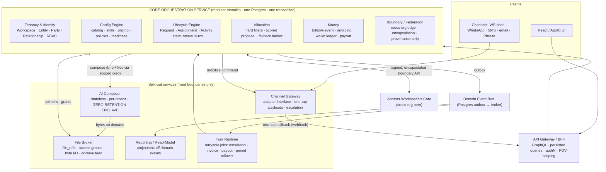
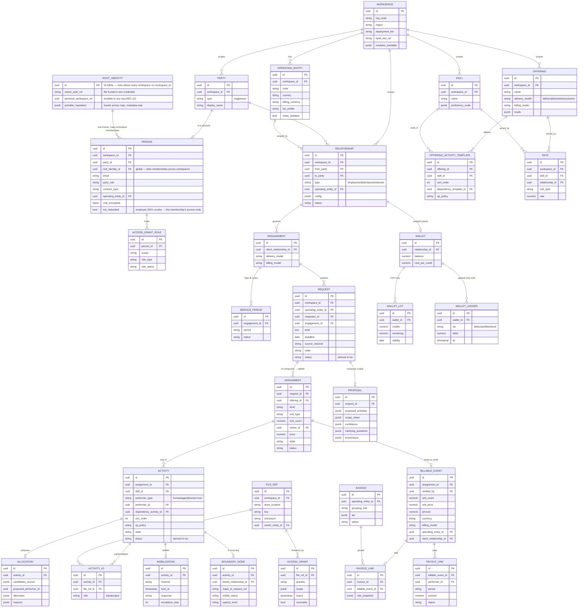

# WS 3.0 — Technical Architecture

**Audience:** Bhavya (architecture sign-off) & Joy (review). **Companion:** [`spec.md`](./spec.md) — the *what* (layers, fields, use-cases). This doc is the **engineering**: stack, service decomposition, data model + DB diagram, communications, events, security/isolation, deployment, and the open architecture calls.

> **System in one line:** a **multi-tenant control plane** that stores the *graph* of orchestrated work (never raw content), runs a single lifecycle engine, and composes plans with AI in a zero-retention enclave. EZ is the first tenant, configured through the same surface as everyone else.

**Conventions:** ✅ = locked in our design discussion · **⚠️ Bhavya** = an open architecture decision for sign-off · `(EZ: …)` = illustrative config only.

---

## 1. Design tenets that constrain the architecture

Everything below serves five non-negotiables we locked (see `spec.md` §11):

1. **One graph, one system, zero sync.** The single biggest lesson from the ERP: the ERP↔WS boundary + Google-Sheets-as-DB caused all the drift, rollback-by-delete, and repair-cron pain. **We do not rebuild that.** → a modular-monolith **core** with one transactional database, not a constellation of services that sync to each other.
2. **Status is derived in the same transaction as the state change.** No async projection to compute state. Events exist for *reporting and integration*, never for deriving truth. → no repair crons, no drift.
3. **Control plane, not content store.** The DB holds metadata + **file pointers**; raw bytes live in tenant storage and are processed in a **zero-retention enclave**. → the enclave and the byte-handling path are *physically separate* from the core.
4. **Config-not-code.** Every EZ-ism is a row, not a branch. → a first-class config schema + a readiness engine, not hardcoded rules.
5. **Two isolation levels.** `workspace_id` (crypto) and `operating_entity_id` (policy) on every record. → enforced at the data layer (RLS), server-authoritative.

---

## 2. Tech stack

| Concern | Choice | Rationale / note |
|---|---|---|
| **API style** | **GraphQL gateway + persisted queries** | one typed contract for a POV-scoped UI; persisted queries cap the attack/perf surface. **⚠️ Bhavya** to confirm GraphQL vs REST. |
| **Backend** | **Python 3.12 / FastAPI** | typed, async-native, fast. (ERP is Django today — **⚠️ Bhavya** confirms FastAPI vs staying Django.) |
| **Core data** | **PostgreSQL 16** | typed relational schema (replaces JSONB `.get().get()`), **row-level security** for `(workspace_id, operating_entity_id)`, strong transactional guarantees for the one-graph engine. |
| **Frontend** | **React + Apollo Client** | reuses WS 2.0 patterns incl. `chat-v2` (the default mobilization channel). |
| **Cache / queue** | **Redis** + a real task runner (**Celery / RQ / Temporal — ⚠️ Bhavya**) | replaces the ~132 fire-and-forget management commands with retryable, audited jobs. |
| **Event backbone** | **Postgres outbox → broker** (Redis Streams / Kafka / NATS — **⚠️ Bhavya**) | reliable event emission without dual-write drift (outbox pattern). |
| **Object storage** | **S3-compatible**, plus connected-cloud & own-infra tiers | the graph stores `file_ref` pointers only; bytes never touch the core DB. |
| **Enclave** | zero-retention compute sandbox (locked egress, ephemeral FS) | AI composer + agent performers run here; bytes in → result out → nothing retained. |
| **AuthN** | OIDC / SSO-ready; portable identity (Phase 2) | replaces derived-password + email-allowlist patterns from the ERP. |
| **Secrets / crypto** | per-workspace keys; **BYOK** for regional/sovereign; field-level encryption (Fernet-class) for cost/pay/PII | salary/PII never stored in plaintext. |
| **Observability** | structured logs + traces + tenant-inspectable audit log | one engine → reporting is reliable by construction. |
| **Infra** | containers + per-tier deployment (shared / regional / sovereign) | tier is a `Workspace` attribute; see §8. |

---

## 3. Service decomposition

**The honest call (⚠️ Bhavya to ratify): a modular-monolith *core*, not a microservice-per-domain.** Splitting config / lifecycle / allocation / money into separate networked services would force distributed transactions and cross-service sync to keep the work graph consistent — **exactly the ERP↔WS drift we are dissolving.** So those live as *modules inside one deployable core, sharing one DB and one transaction boundary.* We split out a service **only** where a genuine hard boundary exists: raw bytes, the enclave, external channels, or read/analytics load.



| Service | Owns | Why separate (or not) | Sync/async |
|---|---|---|---|
| **API Gateway / BFF** | GraphQL schema, persisted queries, authN, POV-scoping | thin edge; one contract for the UI | sync |
| **Core Orchestration** (modular monolith) | the **entire work graph + config + money events**, one Postgres, RLS | **deliberately not split** — one graph, one transaction, zero internal sync | sync (in-process modules) |
| ├ Tenancy & Identity | Workspace, Entity, Party, Relationship, Users, RBAC | module | in-txn |
| ├ Config Engine | catalog, skills, rates, teams, policies, readiness | module | in-txn |
| ├ Lifecycle Engine | Request/Assignment/Activity, state **+ status derived in-txn** | module | in-txn |
| ├ Allocation | hard filters → scored proposal → fallback ladder | module | in-txn |
| ├ Money | billable event, invoicing, wallet ledger, payout | module | in-txn |
| └ Boundary/Federation | cross-org edge, encapsulation, provenance strip | module with a **guarded external API** | sync + signed |
| **AI Composer** | brief→plan composition | **must** be isolated: zero-retention enclave, per-tenant, stateless | sync request/response |
| **File Broker** | `file_ref`s, access grants, enclave byte feed | **must** be isolated: it touches raw bytes | sync + short-lived creds |
| **Channel Gateway** | WS-chat/WhatsApp/SMS/email adapters, escalation | isolates external providers behind one adapter interface | async out, webhook in |
| **Reporting / Read-Model** | analytical projections | keeps read/analytics load off the transactional core (I3) | async (event-fed) |
| **Task Runtime** | escalation, invoice gen, payout runs, period rollovers, pre-mobilization | replaces the 132 hand-run commands with retry+audit | async (queue) |

**⚠️ Bhavya decision:** modular-monolith core (recommended) vs full microservice split. Recommendation stands on tenet #1 — but if the team wants independent scaling/deploy per domain, the trade is distributed-transaction complexity and a sync surface we've worked to eliminate.

---

## 4. Data model & DB diagram

One Postgres schema for the core. Every tenant-scoped table carries **`workspace_id`** and (where work/money/relationships live) **`operating_entity_id`** — both enforced by **row-level security**. Money is typed `Decimal`; cost/pay/PII are field-encrypted; the wallet ledger and audit log are **append-only**.



**Notes on the model**
- **Party + Relationship is the spine.** Tenant/client/vendor are `RELATIONSHIP.type` values, not tables. A cross-org link is one `RELATIONSHIP` row seen as `vendor` by A and `client` by B.
- **Two-layer identity (one person in N workspaces).** `ROOT_IDENTITY` is **global** — one per human, above all workspaces (their login, personal workspace, portable reputation). Each workspace they join gets its own **workspace-scoped `PERSON` membership** that references the root identity. A workspace's core sees only its own `PERSON` rows; **the root→membership mapping is resolved at the identity/gateway layer and never exposed into a tenant's graph** — so WS-A cannot learn the person is also in WS-B. Auth once at the root; act per membership; revoke SSO/offboard ends *that* membership only. The only deliberate cross-workspace signal is `portable_reputation` (metadata-only, superadmin-governed). *(Phase 2 — but modeled now so it needs no rewrite.)*
- **The work graph is a tree** via `ACTIVITY.dependency_activity_id`; independent branches run in parallel, dependent ones gate on their input.
- **`status` is a stored column written in the same transaction as `state`** — not a projection. Reporting reads it; it never computes it.
- **Money is append-only where it must be:** `WALLET_LEDGER` is the source of truth (no sheet mirror); `BILLABLE_EVENT` is immutable once emitted.
- **Files are pointers.** `FILE_REF` never holds bytes; `ACCESS_GRANT` issues the short-lived brokered credentials for the enclave and for cross-org.
- **⚠️ Bhavya:** transactional (this model) vs event-sourced. Recommendation: transactional core with an **outbox** for events — gets reliability without the read-model-as-truth complexity.

---

## 5. Communications

**Principle:** *sync within a transaction boundary, async across one.* Core modules talk in-process (one transaction). Everything crossing the core — bytes, channels, reporting, other workspaces — is an explicit, guarded protocol.

| Path | Mechanism | Why |
|---|---|---|
| UI → Gateway | GraphQL / HTTPS, persisted queries | one typed, POV-scoped contract |
| Gateway → Core | sync call (in-proc or gRPC) | request/response for the graph |
| **Core module ↔ Core module** | **in-process, one DB transaction** | the one-graph rule — **no network sync between config/lifecycle/allocation/money** |
| Core → AI Composer | sync request/response, authenticated; brief/files handed as a **scoped credential**, not bytes | keeps content in the enclave, zero-retention |
| Composer / agents → File Broker | short-lived credential; bytes streamed into the enclave, nothing retained | control-plane discipline |
| Core → Channel Gateway | **async command** ("mobilize", payload) | external providers, ret/escalation |
| Channel → Gateway | **webhook callback** (one-tap accept/decline) | performer never opens the app |
| Core → Reporting / Workers | **domain events via outbox → broker** | reliable, drift-free (state already committed) |
| Worker → Core | authenticated API calls | escalation, invoicing, payouts, period rollover |
| **Core(A) ↔ Core(B)** cross-org | **signed, encapsulated Boundary API** + brokered file grants; provenance stripped per hop | A never sees B's internals; chains re-encapsulate so A never learns C exists |
| Non-WS party | client-system **adapter** (email / Phrase / API) | bounded by that tool's surface |

### The outbox pattern (why no drift)
State + status commit in one transaction **together with** an `outbox` row. A relay publishes outbox rows to the broker. Consumers (reporting, workers) are eventually-consistent — but **truth is already committed in the core**, so a lost/late event never corrupts state. This is the structural fix for the ERP's sync/drift/repair-cron class of bugs.

### Domain events (illustrative)
`RequestCreated · PlanRatified · ActivityPublished · PerformerAccepted · OutputSubmitted · QAPassed · Delivered · BoundarySignedOff · Verified · BillableEventEmitted · InvoiceRaised · PayoutRaised · WalletDeducted/Settled/Refunded · PeriodClosed`. Events drive *reporting, notifications, and integrations* — never state derivation.

---

## 6. Key data-flow — brief → delivered → billed (the 2-touchpoint path, technically)

```
1. Intake      Channel/UI → Gateway → Core.Lifecycle: create REQUEST (source_channel, brief, files→FILE_REF via File Broker)
2. Compose     Core → AI Composer (enclave): reads THIS workspace's config; returns PROPOSAL
                 (offering, activity tree, performers, deadline, scope, price). Bytes stay in the enclave.
3. Ratify #1   Owner approves in UI → Core writes ASSIGNMENT + ACTIVITY tree in ONE txn; state+status set together
4. Mobilize    Core → Channel Gateway (async): one-tap payload per activity; WS-chat first, escalate to WhatsApp/SMS
                 Performer taps accept → webhook → Core sets ACCESS_GRANT_ROLE.role_status=accepted
5. Perform     Human/agent/tool produces output → ACTIVITY_IO(output) → FILE_REF; progress auto-logged
6. QA          qa_policy: auto (agent-safe) or human reviewer Pass/Fail
7. Assemble    When sibling activities + child assignments terminal → deliverable assembled; owner BOUNDARY_SIGNOFF
8. Deliver     Written to requester's store (their property); status roll-up already visible throughout
9. Verify #2   AI pre-computes reconciliation → verifier one-tap CONFIRM (the gate)
10. Money      Core.Money emits BILLABLE_EVENT (immutable) → fans out:
                 → Invoicing (if billing on): WS invoice / external connector / data-out
                 → Payout: PAYOUT_LINE off verified work (rolling), independent of client payment
                 → Wallet: settle the deduction; refund on cancel
11. Loop       ongoing → next period (Type-B SERVICE_PERIOD) · recurring → next cycle · one-off → done
```
Human touchpoints across all of this: **two** (step 3, step 9). Cross-org (Phase 2) inserts a `BOUNDARY_NODE` at step 4 — the performer *is* another workspace, which runs steps 1–11 internally and opaquely.

---

## 7. Security & isolation architecture

**The defensibility principle (vision §8):** *the operator cannot read a BYOK tenant's data — cryptographically, not by promise.* Every mechanism below serves it. This maps to the PRD's SEC-1…SEC-14.

| Control | Mechanism | PRD |
|---|---|---|
| **Workspace isolation (crypto)** | separate keys per workspace; **BYOK** for regional/sovereign; sovereign tenants can get schema-/DB-level separation (**⚠️ Bhavya:** RLS-pooled vs schema-per-tenant vs db-per-tenant). On BYOK, operator reads return ciphertext — **not decryptable, incl. the client list.** | SEC-8 |
| **Entity isolation (policy)** | **Postgres RLS** on `(workspace_id, operating_entity_id)`; default isolated; `entity_isolation` flag; entity-delegated module-admins can blind even the org admin | SEC-6 |
| **Control plane, not content** | the graph holds `file_ref` pointers only; **never custodies bytes** | SEC-1 |
| **Sealed zero-retention enclave** | bytes pulled ephemerally → compute → return → retain nothing; **locked egress, ephemeral FS**; access flows to the *tool*, never a person | SEC-3 |
| **Two processing modes by tier** | **Option B** (WS-controlled regional enclave) for shared/regional; **Option A** (in-environment runtime, **no egress**) required for sovereign — content-processing/AI runs inside the tenant's own environment. Phase 2+. | SEC-5 |
| **Two-layer need-to-know** | (1) **tool-pull scope** — what WS-the-tool may fetch from a tenant at all (the scoped credential); (2) **user-view scope** — POV-scoping per role. Both server-side. | SEC-6 |
| **Scoped tenant-API credential** | **JIT, least-privilege, short-lived per-grant tokens** minted by the File Broker; never a standing broad credential. A leak exposes **one file for minutes**. The crown-jewel surface. | SEC-7 |
| **No-human-bytes governance** | **no tenant content in logs**, no human debugging on raw data, stateless AI; enforced, not policy | SEC-4 |
| **Cross-org encapsulation** | opaque `BOUNDARY_NODE`; provenance stripped per hop; brokered file `ACCESS_GRANT` (scoped, expiring, revocable); deliverables written to the recipient's store | SEC-1, SEC-7 |
| **RBAC** | **server-authoritative**, config-driven (replaces frontend-JSON perms + email allowlists); persisted, POV-scoped GraphQL | SEC-6 |
| **Encryption at rest** | field-level (Fernet-class) for cost/pay/PII; salary never in plaintext | NFR-2 |
| **Tamper-evident audit** | append-only `AuditEvent`, **tenant-inspectable**, covers **operator/admin actions** ("don't-trust-us-verify") | SEC-9 |
| **Identity & revocation** | OIDC/SSO federation; **revoke SSO → live access ends**; freelancers on their own portable identity; personal workspace **unreachable from any org** (SEC-12). Phase 2. | SEC-10, SEC-12 |
| **No cross-tenant training** | composer/allocator per-tenant, stateless, zero-retention; cross-tenant training **prohibited**; any training consent-tiered, sovereignty excluded by design | SEC-13 |

---

## 8. Deployment topology

`Workspace.deployment_tier` selects the tier at provisioning. **The guarantee scales with the tier (vision §8):**

| Tier | Storage | Processing/AI | Keys | **Operator can read?** | Infra |
|---|---|---|---|---|---|
| **Shared** | WS multi-tenant (RLS) | WS enclave (Option B) | WS-managed | Yes (custodial) | shared cluster |
| **Regional** | WS, region-pinned | WS enclave, regional (Option B) | **BYOK** | **No (cryptographic)** | region-scoped cluster |
| **Sovereign** | Tenant infra, **no egress** | In-environment runtime (Option A) | **BYOK** | **No (cryptographic)** | isolated infra / own cloud |

- The enclave, File Broker, and Channel Gateway deploy **per region** so bytes and PII never leave residency.
- *(EZ resells these as its Standard/Compliant/Private tiers — a mapping, not a product distinction.)*
- Entity→separate-workspace migration (Layer 5) is a **data-separation operation** (re-key + move into a new keyed store) — supported, but heavier than a config toggle. Flagged honestly.

---

## 9. Reliability & the ERP failure classes we design out

| ERP failure class | Structural fix here |
|---|---|
| ERP↔WS sync drift, rollback-by-delete | **one graph, one system, zero sync** (§1, §3) |
| Google-Sheets-as-database | typed Postgres; **ledger is the source of truth** |
| Status drift, repair crons | **status derived in the write transaction** (§4, §5) |
| ~132 fire-and-forget management commands | **Task Runtime** with retry + audit (§3) |
| Untested money math, xlsx imports | typed `Decimal`, **parity-test catalog before any money code**, live-fed (no imports) |
| Frontend-JSON permissions, email allowlists | server-authoritative, config-driven RBAC (§7) |

---

## 10. Engineering conventions — the efficient way to write the code

**The point of this section:** the ERP failed less on *choice of framework* than on *how the code was written* — sheets used as a database, tenant rules hardcoded, status recomputed by crons, money math untested. These conventions are what keep WS 3.0 from repeating that. **They are binding, not stylistic.**

| # | Convention | Rule | Never |
|---|---|---|---|
| **C1** | **Config, not code** | Behaviour is resolved from config rows at runtime. A new tenant/offering/rule is *data*. | `if tenant == "EZ"`; any org-specific branch |
| **C2** | **Status in the write txn** | Derive `status` in the same transaction that changes `state`; store it. | a cron/job that "recomputes" or "repairs" status |
| **C3** | **Outbox for events** | Emit domain events by writing an `outbox` row in the same txn; a relay publishes. | dual-writing to the DB and a broker separately |
| **C4** | **RLS by default** | Every query is scoped by `(workspace_id, operating_entity_id)` at the data layer. | ad-hoc `WHERE` scoping in app code; trusting the client |
| **C5** | **Typed, idempotent money** | `Decimal` + explicit currency; money ops carry an idempotency key; the ledger is append-only. | floats; mutable balances as source of truth; untested math |
| **C6** | **Capability gating** | A turned-off capability's fields/endpoints don't exist for that workspace. | collecting/validating data a capability doesn't need |
| **C7** | **Suggest, not act (AI)** | The composer/allocator return *proposals*; a human ratifies before anything is real. | auto-committing an AI plan or allocation |
| **C8** | **One graph, one txn** | Config/lifecycle/allocation/money mutate the graph in one transaction, in-process. | networked service-to-service sync to keep the graph consistent |
| **C9** | **Content stays in the enclave** | The core receives `file_ref`s + scoped credentials, never bytes; bytes live and die in the enclave. | passing raw content through the core or persisting it |
| **C10** | **Persisted, POV-scoped GraphQL** | Only allowlisted queries; resolvers enforce role + scope server-side. | arbitrary client queries; client-side permission checks |

### The patterns, concretely

**C1 — resolve from config (no tenant branches):**
```python
# GOOD — behaviour is data
offering = catalog.get(assignment.offering_id, version=assignment.offering_version)
tree     = offering.activity_templates                 # the plan shape is config
weights  = policy.objective_weights                    # allocation is config
# BAD — never do this
# if workspace.code == "EZ": tree = [...]              # hardcoded org rule
```

**C2 + C3 — status derived in-txn, event via outbox (kills drift):**
```python
with db.transaction():
    activity.state  = "delivered"
    activity.status = derive_status(activity)          # same txn, stored — not a cron
    assignment.status = rollup(assignment)             # worst-of over the tree, same txn
    outbox.append(Event("ActivityDelivered", activity.id))   # same txn
# a separate relay publishes committed outbox rows → reporting/workers
```

<details>
<summary>▸ JSON: a domain event (outbox → broker)</summary>

```jsonc
{
  "event_id": "evt_uuid",
  "type": "BillableEventEmitted",
  "workspace_id": "ws_uuid", "operating_entity_id": "ent_uuid",
  "occurred_at": "2026-07-17T10:00:00Z",
  "payload": { "billable_event_id": "be_uuid", "assignment_ref": "asg_uuid", "amount": 800, "currency": "USD" },
  "trace_id": "…"          // events drive reporting/notify/integration — never state derivation
}
```
</details>

<details>
<summary>▸ JSON: a persisted, POV-scoped GraphQL query (C10)</summary>

```jsonc
// Client sends an ID, not a query string — server has the allowlisted document.
{ "id": "q_workConsole_requestTree_v1",
  "variables": { "request_id": "req_uuid" } }
// Resolver enforces: actor role ∈ {owner,performer,…} AND row scope (workspace_id, operating_entity_id).
// A performer sees only their activities; a sibling entity sees nothing.
```
</details>

**C5 — money is typed, idempotent, append-only:**
```python
# deduct at assignment-create, settle at verify, refund on cancel — each idempotent
ledger.append(WalletEntry(op="deduct", delta=Money("-800", "USD"),
                          ref=assignment.id, idem_key=f"deduct:{assignment.id}"))
# balance is a projection of the ledger, never the source of truth
```

**Definition of done for any feature:** config-driven (C1) · state+status atomic (C2) · events via outbox (C3) · RLS-scoped (C4) · money typed+tested against the parity catalog (C5, NFR-7) · gated by capability (C6) · no content through the core (C9).

---

## 11. Open architecture decisions — ⚠️ Bhavya sign-off

1. **Core shape** — modular-monolith core (recommended, tenet #1) vs full microservices.
2. **Engine model** — transactional + outbox (recommended) vs event-sourced.
3. **API** — GraphQL + persisted queries (assumed) vs REST.
4. **Isolation mechanism** — RLS-pooled vs schema-per-tenant vs db-per-tenant, per tier.
5. **Async infra** — task runner (Celery / RQ / Temporal) and broker (Redis Streams / Kafka / NATS).
6. **Stack confirmation** — FastAPI (proposed) vs staying on Django; Postgres version; deployment substrate.
7. **Repository layout** — how many repos we build. Recommendation: **~2** — one **product monorepo** (core + frontend + File Broker/Channel Gateway/Reporting/Task Runtime as internal services) plus a **separate AI Composer / enclave repo**. The enclave is proposed as its own repo because it deploys into the sealed, zero-retention, sometimes in-tenant / no-egress environment and should stay minimal and independently auditable — **this specific split is for Bhavya to confirm.** The fork: if Bhavya prefers a classic backend/frontend split, it becomes **3** (backend + frontend + enclave). Everything else stays a module, not a repo, to avoid cross-repo sync.

**None of these reshape the data model or the layer design** — they select mechanisms at the marked points.

---

## 12. Build path (gates, not a sprint)

```
DESIGN (now, no code)
   spec.md ✅  (PRD/BRS, field-level)   ·   architecture.md ✅  (this doc)
        ├─ Joy answers the [J] items ──┐
        ├─ Bhavya answers §11 ─────────┤→ ARCHITECTURE v2 → sign-off
        └─ parity-test catalog + migration mapping (last solo pieces)
                 ▼
   BUILD (only on Shreyanshi's "go")
   scaffold → typed model (§4) → PARITY TESTS FIRST → migration →
   Phase-1 features → strangler-fig cutover (capability-by-capability)
                 ▼
   PHASE 2 — cross-org / multi-tenant (boundary + entity-isolation already in; no rewrite)
```

**Gates:** Design (solo) → Joy + Bhavya inputs → **Architecture v2 sign-off (Bhavya)** → Shreyanshi's "build" → strangler-fig cutover.

---

## 13. What to review here

- **§3** — the modular-monolith-core call (decision #1). This is the most consequential architecture choice; it's deliberately conservative to avoid rebuilding the ERP's sync pain.
- **§4** — the data model / DB diagram. Is the Party+Relationship spine and the work-graph tree right?
- **§5** — communications + the outbox pattern (how we kill drift for good).
- **§7–§8** — isolation and deployment tiers.
- **§10** — the engineering conventions (the binding "how to write the code" rules).
- **§11** — the six open decisions that need your sign-off.

The *what* (layers, fields, use-cases, how each scenario runs) is in **[`spec.md`](./spec.md)**.
